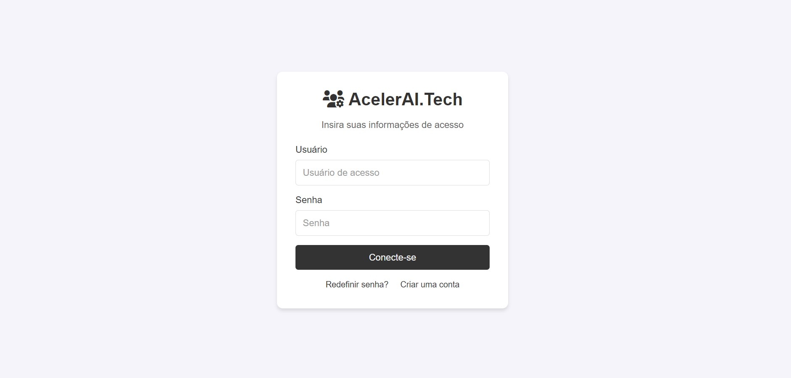

# Login Minimalista

Este é um projeto simples de uma tela de login minimalista, desenvolvido utilizando **HTML**, **CSS** e **JavaScript**. O foco principal é criar uma interface de usuário limpa e funcional para o processo de login.

## Funcionalidades

- Interface de login responsiva e minimalista
- Placeholder intuitivo nos campos de **nome do usuário** e **senha**
- Links para redefinir senha e criar uma nova conta
- Sistema de login simulado utilizando uma API via **fetch**

## Tecnologias Utilizadas

- **HTML5**: Estruturação da página
- **CSS3**: Estilização da interface
- **JavaScript**: Manipulação de eventos e comunicação com API

## Simulação de API
No código JavaScript, a função `loginRepository.login()` é usada para enviar as credenciais de login (username e password) para uma API simulada:

````bash
loginRepository.login({username, password}, _fetch = fetch) {
    _fetch("https://suelen.com/api/login", {
        method: "POST",
        headers: { "Content-Type": "application/json" },
        body: JSON.stringify({ username, password }),
    })
    .then(response => response.json())
    .then(data => console.log("Login bem-sucedido", data))
    .catch(error => console.error("Falha no login", error));
}
````

Essa implementação simula uma chamada para uma API de login fictícia, mas pode ser facilmente adaptada para um backend real.


## Como Executar o Projeto

### Pré-requisitos
Para executar o projeto, você precisa apenas de um navegador web.

### Passos para executar

1. Clone o repositório para sua máquina local:
   ```bash
   git clone https://github.com/seu-usuario/login-minimalista.git

2. Navegue até o diretório do projeto:
   ```bash
   cd login-minimalista
   
3. Abra o arquivo ``index.html`` no seu navegador ou utilize uma extensão como Live Server no VS Code para visualizar o projeto localmente.


💡 Melhorias Futuras
- Implementar validações mais avançadas nos campos de nome de usuário e senha
- Adicionar feedback visual de erro ou sucesso ao tentar logar
- Substituir o backend simulado por uma API real

📷 Tela de Login

Aqui está uma captura de tela da interface de login:




